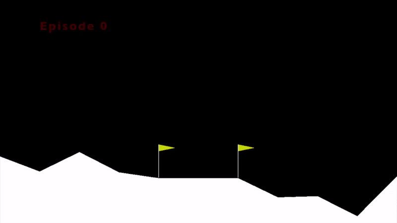

<h1 align="center">Lunar Lander</h1>
Lunar Lander - Reinforcement learning problem solved using Expected SARSA as the capstone project for the Reinforcement Learning Specialization offered by University of Alberta on Coursera.
  

<h2 align="left">Learning Curve</h2>
  

